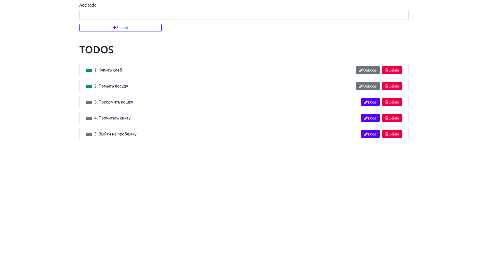

# TODO - это общепринятое обозначение напоминания о том, что необходимо сделать. 
# Произошло от понятия to do list, или список дел.

В этом приложении пользователю доступно добавление задач в список.

Так же пользователю доступна возможность отметить ту задачу, которую он уже выполнил, ставя галочку или же по клику на кнопку, обозначая, что задача выполнена.

Если пользователю задача больше не нужна в списке дел, он удаляет ее по клику.

#### Чтобы запустить приложение выполните следующие команды:

_Client:_
* npm install;
* npm start;

_Server:_
* npm install;
* npm start;
